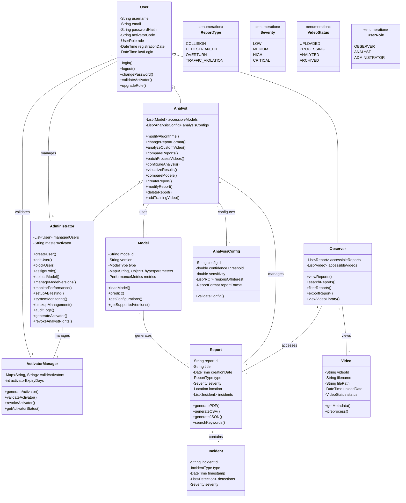

# Диаграмма классов

```mermaid
classDiagram
    %% Основной класс пользователя
    class User {
        -String username
        -String email
        -String passwordHash
        -String activatorCode
        -UserRole role
        -DateTime registrationDate
        -DateTime lastLogin
        +login()
        +logout()
        +changePassword()
        +validateActivator()
        +upgradeRole()
    }

    %% Классы пользователей с наследованием
    class Observer {
        -List~Report~ accessibleReports
        -List~Video~ accessibleVideos
        +viewReports()
        +searchReports()
        +filterReports()
        +exportReport()
        +viewVideoLibrary()
    }

    class Analyst {
        -List~Model~ accessibleModels
        -List~AnalysisConfig~ analysisConfigs
        +modifyAlgorithms()
        +changeReportFormat()
        +analyzeCustomVideo()
        +compareReports()
        +batchProcessVideos()
        +configureAnalysis()
        +visualizeResults()
        +compareModels()
        +createReport()
        +modifyReport()
        +deleteReport()
        +addTrainingVideo()
    }

    class Administrator {
        -List~User~ managedUsers
        -String masterActivator
        +createUser()
        +editUser()
        +blockUser()
        +assignRole()
        +uploadModel()
        +manageModelVersions()
        +monitorPerformance()
        +setupABTesting()
        +systemMonitoring()
        +backupManagement()
        +auditLogs()
        +generateActivator()
        +revokeAnalystRights()
    }

    %% Новый класс для управления активаторами
    class ActivatorManager {
        -Map~String, String~ validActivators
        -int activatorExpiryDays
        +generateActivator()
        +validateActivator()
        +revokeActivator()
        +getActivatorStatus()
    }

    class Report {
        -String reportId
        -String title
        -DateTime creationDate
        -ReportType type
        -Severity severity
        -Location location
        -List~Incident~ incidents
        +generatePDF()
        +generateCSV()
        +generateJSON()
        +searchKeywords()
    }

    class Video {
        -String videoId
        -String filename
        -String filePath
        -DateTime uploadDate
        -VideoStatus status
        +getMetadata()
        +preprocess()
    }

    class Model {
        -String modelId
        -String version
        -ModelType type
        -Map~String, Object~ hyperparameters
        -PerformanceMetrics metrics
        +loadModel()
        +predict()
        +getConfigurations()
        +getSupportedVersions()
    }

    class AnalysisConfig {
        -String configId
        -double confidenceThreshold
        -double sensitivity
        -List~ROI~ regionsOfInterest
        -ReportFormat reportFormat
        +validateConfig()
    }

    class Incident {
        -String incidentId
        -IncidentType type
        -DateTime timestamp
        -List~Detection~ detections
        -Severity severity
    }

    %% Перечисления
    class ReportType {
        <<enumeration>>
        COLLISION
        PEDESTRIAN_HIT
        OVERTURN
        TRAFFIC_VIOLATION
    }

    class Severity {
        <<enumeration>>
        LOW
        MEDIUM
        HIGH
        CRITICAL
    }

    class VideoStatus {
        <<enumeration>>
        UPLOADED
        PROCESSING
        ANALYZED
        ARCHIVED
    }

    %% Ассоциации
    Observer "1" -- "*" Report : accesses
    Observer "1" -- "*" Video : views
    Analyst "1" -- "*" Model : uses
    Analyst "1" -- "*" AnalysisConfig : configures
    Analyst "1" -- "*" Report : manages
    Administrator "1" -- "*" User : manages
    Report "1" -- "*" Incident : contains
    Model "1" -- "*" Report : generates

    %% Перечисления
    class UserRole {
        <<enumeration>>
        OBSERVER
        ANALYST
        ADMINISTRATOR
    }

    %% Связи наследования
    User <|-- Observer
    User <|-- Analyst
    Analyst <|-- Administrator

    %% Ассоциации
    Administrator "1" -- "1" ActivatorManager : manages
    User "1" -- "1" ActivatorManager : validates

```