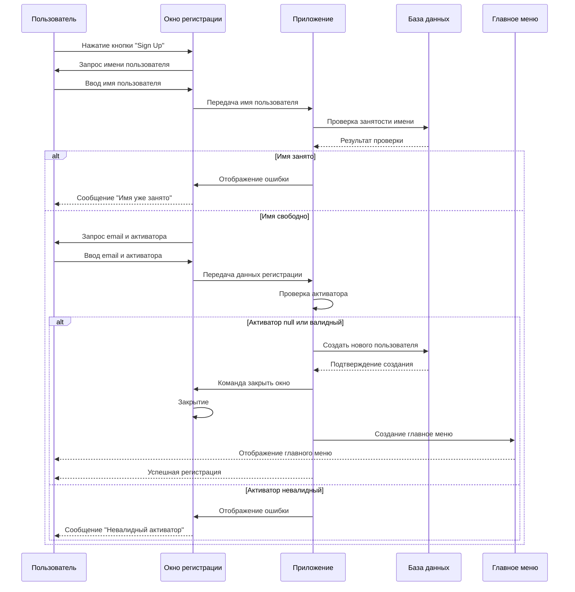
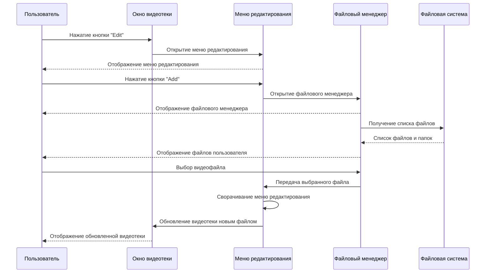
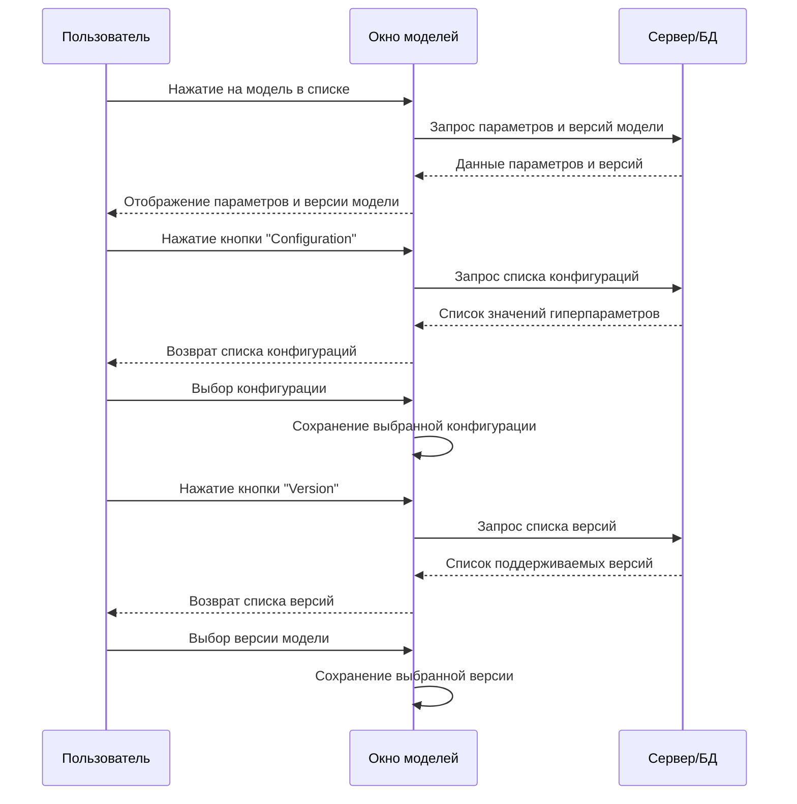
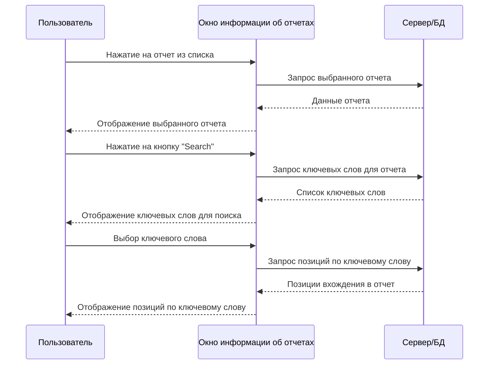
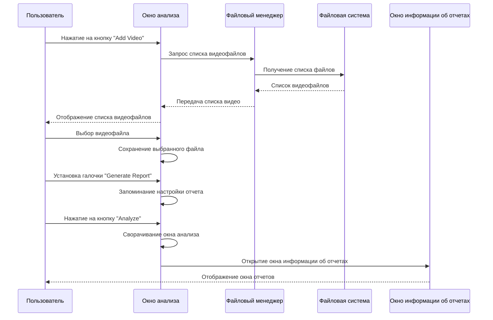

# Диаграммы последовательностей

# Содержание
1 [Вход в систему](#1-вход-в-систему-1)    
2 [Регистрация в системе](#2-регистрация-в-системе-1)  
3 [Добавление видео](#3-добавление-видео-1)  
4 [Выбор модели](#4-выбор-модели-1)   
5 [Просмотр отчета](#5-просмотр-отчета-1)  
6 [Генерация отчета](#6-генерация-отчета-1)  

## 1 Вход в систему  

## 2 Регистрация в системе

## 3 Добавление видео  

## 4 Выбор модели  

## 5 Просмотр отчета

## 6 Генерация отчета  
