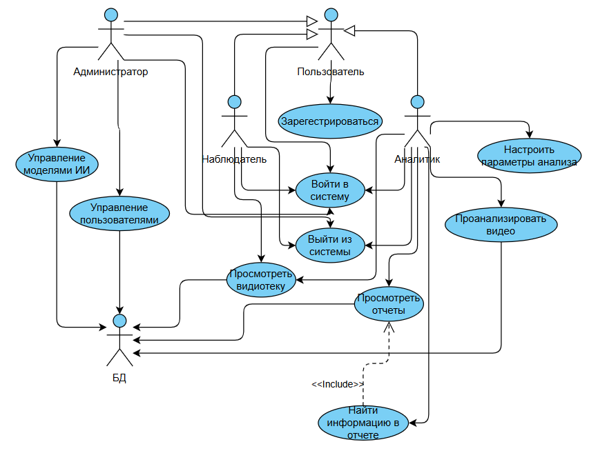

# Диаграмма вариантов использования
  
# Глоссарий
Термин | Определение
-------|-----------
Пользователь | Человек, использующий систему анализа видеопотоков
Наблюдатель | Пользователь с правами только на просмотр отчетов и видеотеки
Аналитик | Пользователь с правами на изменение алгоритмов, работу с моделями и создание отчетов
Администратор | Пользователь с правами управления другими пользователями и системой
Активатор | Специальный код для получения прав аналитика
Видeотека | Коллекция видеофайлов, доступных для анализа в системе
Отчет | Документ, содержащий результаты анализа видеопотока с классификацией инцидентов
Модель ИИ | Алгоритм машинного обучения для детекции и классификации объектов в видео
WTS датасет | Тестовый набор данных для проверки работы моделей

# Содержание
1. [Актёры](#1-актёры)  
2. [Варианты использования](#2-варианты-использования)    
2.1 [Войти в систему](#21-войти-в-систему)   
2.2 [Зарегистрироваться](#22-зарегистрироваться)   
2.3 [Просмотреть видеотеку](#23-просмотреть-видеотеку)    
2.4 [Просмотреть отчеты](#24-просмотреть-отчеты)   
2.5 [Найти информацию в отчете](#25-найти-информацию-в-отчете)  
2.6 [Проанализировать видео](#26-проанализировать-видео)  
2.7 [Настроить параметры анализа](#27-настроить-параметры-анализа)   
2.8 [Управление моделями ИИ](#28-управление-моделями-ии)  
2.9 [Управление пользователями](#29-управление-пользователями)  
2.10 [Выйти из системы](#210-выйти-из-системы)    

## 1 Актёры
Актёр | Описание
------|----------
Пользователь | Человек, использующий систему анализа видеопотоков
Наблюдатель | Пользователь с правами только на просмотр отчетов и видеотеки
Аналитик | Пользователь с правами на изменение алгоритмов и работу с моделями
Администратор | Пользователь с правами управления системой и пользователями
Локальная БД | База данных на ПК для хранения пользователей, отчетов и настроек

## 2 Варианты использования

### 2.1 Войти в систему
**Описание.** Вариант использования "Войти в систему" позволяет пользователю войти в учетную запись.

**Предусловия.** Пользователь запустил приложение и выбрал способ "Sign in".

**Основной поток.**
1. Приложение отображает окно входа в систему;
2. Пользователь вводит свое имя пользователя;
3. Пользователь подтверждает ввод;
4. Приложение проверяет существование пользователя в базе данных;
5. Приложение определяет права пользователя (Наблюдатель/Аналитик/Администратор);
6. Приложение скрывает окно входа;
7. Приложение отображает главное меню согласно правам доступа;
8. Вариант использования завершается.

**Альтернативный поток А1. Пользователь не существует**
1. Приложение сообщает об ошибке "Пользователь не найден";
2. Возврат к п.2 основного потока.

### 2.2 Зарегистрироваться
**Описание.** Вариант использования "Зарегистрироваться" позволяет пользователю создать учетную запись.

**Предусловия.** Пользователь выбрал способ "Sign up" для регистрации.

**Основной поток.**
1. Приложение отображает окно регистрации;
2. Пользователь вводит имя пользователя;
3. Приложение проверяет уникальность имени. Если имя занято, выполняется А2;
4. Пользователь вводит email;
5. Пользователь вводит активатор (опционально);
6. Пользователь подтверждает регистрацию;
7. Приложение проверяет активатор. Если активатор невалидный, выполняется А3;
8. Приложение создает учетную запись с соответствующими правами;
9. Приложение скрывает окно регистрации;
10. Приложение отображает главное меню;
11. Вариант использования завершается.

**Альтернативный поток А2. Имя занято**
1. Приложение сообщает "Имя пользователя уже существует";
2. Возврат к п.2 основного потока.

**Альтернативный поток А3. Невалидный активатор**
1. Приложение сообщает "Невалидный активатор";
2. Приложение создает учетную запись с правами Наблюдателя;
3. Переход к п.9 основного потока.

### 2.3 Просмотреть видеотеку
**Описание.** Позволяет пользователю просмотреть доступные видеофайлы.

**Предусловия.** Пользователь авторизован в системе.

**Основной поток.**
1. Пользователь выбирает раздел "Видеотека";
2. Приложение загружает список доступных видеофайлов;
3. Приложение отображает видеотеку с превью видео;
4. Вариант использования завершается.

### 2.4 Просмотреть отчеты
**Описание.** Позволяет пользователю просматривать сгенерированные отчеты.

**Предусловия.** Пользователь авторизован и имеет права Наблюдателя или выше.

**Основной поток.**
1. Пользователь выбирает раздел "Отчеты";
2. Приложение загружает список отчетов из локальной БД;
3. Приложение отображает таблицу отчетов с фильтрами;
4. Пользователь применяет фильтры (дата, тип инцидента, серьезность);
5. Приложение отображает отфильтрованные отчеты;
6. Вариант использования завершается.

### 2.5 Найти информацию в отчете
**Описание.** Позволяет выполнить поиск по ключевым словам в отчетах.

**Предусловия.** Пользователь открыл окно просмотра отчетов.

**Основной поток.**
1. Пользователь нажимает кнопку "Search";
2. Приложение отображает список ключевых слов для отчета;
3. Пользователь выбирает ключевое слово;
4. Приложение находит все вхождения слова в отчете;
5. Приложение отображает позиции вхождения;
6. Вариант использования завершается.

### 2.6 Проанализировать видео
**Описание.** Позволяет аналитику запустить анализ видео с генерацией отчета.

**Предусловия.** Пользователь имеет права Аналитика.

**Основной поток.**
1. Пользователь открывает окно анализа;
2. Пользователь нажимает "Add Video";
3. Приложение отображает список видеофайлов;
4. Пользователь выбирает видео для анализа;
5. Пользователь устанавливает галочку "Generate Report";
6. Пользователь нажимает "Analyze";
7. Приложение сворачивает окно анализа;
8. Приложение открывает окно отчетов;
9. Вариант использования завершается.

### 2.7 Настроить параметры анализа
**Описание.** Позволяет аналитику настроить параметры детекции.

**Предусловия.** Пользователь имеет права Аналитика.

**Основной поток.**
1. Пользователь выбирает модель из списка;
2. Приложение отображает параметры и версии модели;
3. Пользователь нажимает "Configuration";
4. Приложение отображает список конфигураций гиперпараметров;
5. Пользователь выбирает конфигурацию;
6. Пользователь нажимает "Version";
7. Приложение отображает список версий модели;
8. Пользователь выбирает версию;
9. Приложение сохраняет настройки;
10. Вариант использования завершается.

### 2.8 Управление моделями ИИ
**Описание.** Позволяет администратору управлять моделями ИИ.

**Предусловия.** Пользователь имеет права Администратора.

**Основной поток.**
1. Пользователь выбирает раздел "Управление моделями";
2. Приложение отображает список моделей и их версий;
3. Администратор загружает новую модель;
4. Администратор настраивает версионирование;
5. Администратор запускает A/B тестирование;
6. Приложение сохраняет изменения;
7. Вариант использования завершается.

### 2.9 Управление пользователями
**Описание.** Позволяет администратору управлять пользователями системы.

**Предусловия.** Пользователь имеет права Администратора.

**Основной поток.**
1. Пользователь выбирает раздел "Управление пользователями";
2. Приложение отображает список пользователей;
3. Администратор создает/редактирует/блокирует пользователей;
4. Администратор назначает роли;
5. Администратор генерирует активаторы;
6. Приложение синхронизирует изменения с веб-сервером;
7. Вариант использования завершается.

### 2.10 Выйти из системы
**Описание.** Позволяет пользователю выйти из учетной записи.

**Предусловия.** Пользователь авторизован в системе.

**Основной поток.**
1. Пользователь выбирает пункт меню "Exit";
2. Приложение закрывает главное окно;
3. Приложение отображает окно входа в систему;
4. Вариант использования завершается.